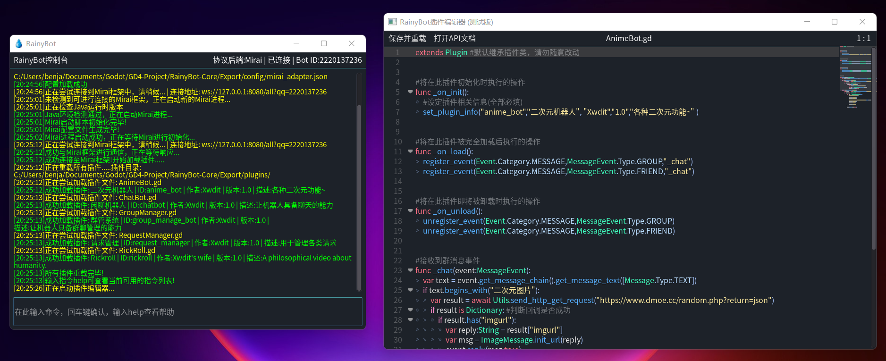

<!-- PROJECT LOGO -->
 

  

  <h3 align="center">RainyBot</h3>

  

    新手友好，简单易上手的跨平台聊天机器人开发框架
     
    <a href="https://github.com/Xwdit/RainyBot-Core/releases"><strong>立即下载</strong></a>
     
     
    <a href="https://github.com/Xwdit/RainyBot-API">API文档</a>
    ·
    <a href="https://github.com/Xwdit/RainyBot-Core/issues">问题报告</a>
    ·
    <a href="https://github.com/Xwdit/RainyBot-Core/issues">功能请求</a>
  

<!-- TABLE OF CONTENTS -->

  
本页目录

  <ol>
    <li>
      <a href="#关于本项目">关于本项目</a>
      <ul>
        <li><a href="#基于的项目">基于的项目</a></li>
      </ul>
    </li>
    <li>
      <a href="#开始使用">开始使用</a>
      <ul>
        <li><a href="#运行需求">运行需求</a></li>
        <li><a href="#配置与使用">配置与使用</a></li>
        <li><a href="#源码注意事项">源码注意事项</a></li>
      </ul>
    </li>
    <li><a href="#插件示例">插件示例</a></li>
    <li><a href="#功能开发路线图">开发路线图</a></li>
    <li><a href="#贡献指南">贡献指南</a></li>
    <li><a href="#项目许可">项目许可</a></li>
    <li><a href="#联系信息">联系方式</a></li>
    <li><a href="#更多信息">更多信息</a></li>
  </ol>

<!-- ABOUT THE PROJECT -->
## 关于本项目

这是一个跨平台，跨协议 (实现中) 的机器人开发框架，基于 Godot Engine 4.0 进行开发。
本项目成立的目的，是为了建立一个低门槛，简单易用的机器人开发框架。
通过提供大量精心设计的交互API/预置功能，结合GDScript脚本语言的简便语法，
来尽可能地提升开发效率且降低开发难度，且让更多开发经验不足，乃至无经验的用户也能够轻松开发属于自己的各类机器人应用。

功能特色:
* 模块化设计，大部分API可独立于协议后端存在，通过不同适配器实现即可对接不同协议，实现一次编写多处运行 (当前仅支持Mirai-Http协议后端)
* 简单易懂的配置与管理，一次配置完成后自动管理各个协议后端的配置/运行/连接，无需每次手动启动或进行设置
* 完善易用且智能的API，可自动根据传入内容的类型决定与机器人的交互行为；同时内置大量诸如上下文交互，关键词触发，事件阻塞一类的便捷功能
* 灵活的插件管理机制，支持插件间交互/热重载/热编辑/依赖设定等功能，同时内置功能较为全面的插件编辑器，可便捷地即时开发与修改插件
* 人性化GUI控制台界面，全中文调试信息输出，未来还将支持插件与GUI的交互（如自定义GUI界面)
* 开箱即用的各类辅助功能接口，可便捷初始化并管理插件配置，插件数据，事件/命令注册等
* 活跃的功能开发与问题修复，且将以社区为驱动，广泛采纳各类建议与需求，共同打造属于所有人的RainyBot
* 更多功能陆续增加中.....

*注意：本项目仍处于开发阶段，虽然目前核心功能已完备，但依然有在未经提前通知的基础上进行较大API/功能更改的可能，且可能存在未知的Bug/不稳定因素，请谨慎用于生产环境。*

(<a href="#top">返回顶部</a>)

### 基于的项目

以下列表列出了本项目所基于的项目，使用本项目时请同时参考它们的许可信息。

* [Godot Engine](https://github.com/godotengine/godot)
* [Mirai-Api-HTTP](https://github.com/project-mirai/mirai-api-http)
* [Mirai](https://github.com/mamoe/mirai)

(<a href="#top">返回顶部</a>)

<!-- GETTING STARTED -->
## 开始使用

接下来的部分将介绍如何配置与使用RainyBot

### 运行需求

支持的操作系统：64位 Windows 7 或以上版本 (Mac OS/Linux支持将在后续版本中添加)

Java 版本 >= 11 (此需求来源于RainyBot默认集成的Mirai协议后端，核心无需任何运行环境)

可选：支持Vulkan渲染器的图形卡 (可通过硬件加速提升性能)

### 配置与使用

1. 从GitHub发布页下载最新的发布版本: <a href="https://github.com/Xwdit/RainyBot-Core/releases"><strong>立即下载</strong></a>
2. 运行RainyBot，随后按照控制台显示的说明，打开指定的配置文件进行配置
3. 配置完毕后请重新启动RainyBot。此时若配置正确，将自动开始加载内置的协议后端（当前版本内置了Mirai协议库)
4. 请留意 *协议后端* 的控制台信息，可能会要求您进行登陆验证等操作，您可以从以下链接获取相关帮助: <a href="https://mirai.mamoe.net/topic/223/%E6%97%A0%E6%B3%95%E7%99%BB%E5%BD%95%E7%9A%84%E4%B8%B4%E6%97%B6%E5%A4%84%E7%90%86%E6%96%B9%E6%A1%88"><strong>Mirai协议库</strong></a>
5. 若一切顺利，协议后端的控制台中将出现中文或英文的登录成功/加载成功字样，且RainyBot控制台中将出现加载成功字样
6. 此时起可最小化协议后端的控制台窗口，后续操作均只需在RainyBot控制台中进行即可。从此处开始，将直接使用“控制台”来表示RainyBot的控制台界面
7. 在控制台中输入指令`help`(或`/help`)来查看所有可用的控制台指令，如输入`plugins`可查看插件管理相关指令
8. 恭喜！您成功完成了RainyBot的基本配置，开始尽情使用吧~

### 源码注意事项

如果您希望从项目源码顺利运行/编译RainyBot，请确保遵循以下条目：
- 请使用 Commit [[2f4d76f068](https://github.com/Xwdit/godot/commit/2f4d76f068b29783bde653406b51909b29a082a3)] 或以上版本的 [Godot Engine 4.0](https://github.com/godotengine/godot) 来打开本项目。
- 请将 [Mirai](https://github.com/mamoe/mirai) 与 [Mirai-Console](https://github.com/mamoe/mirai-console) 的`v2.9.2`版Jar文件及相关依赖文件置于*与Godot编辑器可执行文件同目录下*的`adapters/mirai/libs`路径中
- 请将 [Mirai-Api-HTTP](https://github.com/project-mirai/mirai-api-http) 的`v2.4.0`版Jar文件置于*与Godot编辑器可执行文件同目录下*的`adapters/mirai/plugins`路径中

RainyBot的[发布版本](https://github.com/Xwdit/RainyBot-Core/releases)中已包含以上所需文件，因此无需额外进行配置。若您在配置以上文件时遇到问题，可以直接从最新的发布版本文件包中复制`adapters`文件夹以及其中的内容，并置于*Godot编辑器可执行文件同目录下*即可。

(<a href="#top">返回顶部</a>)

<!-- USAGE EXAMPLES -->
## 插件示例

当前的发布版本中随附了六个示例插件，分别为：聊天机器人，随机动漫音乐/图片，简易群管，好友/拉群请求管理，轮盘赌，复读机插件。您可以在`plugins`文件夹下找到它们，并使用`plugins edit`指令来进行编辑。
同时，对于使用`plugins create`指令新建的插件，将自动使用内置的插件模板，以便于您快速开始开发流程。

_若需查看更详细的已分类API文档与插件示例，请访问 [RainyBot-API](https://github.com/Xwdit/RainyBot-API) 储存库_

(<a href="#top">返回顶部</a>)

<!-- ROADMAP -->
## 主要功能开发路线图

- [x] 核心功能完备
- [x] 整理并将项目开源
- [x] 支持插件间依赖/加载顺序判断功能
- [x] 实现上下文交互功能
- [x] 实现关键词注册与触发功能
- [x] 完善事件系统，支持事件优先级与阻塞模式
- [x] 各类API大幅简化/智能化
- [x] 关键词相关功能的大幅改进
- [x] 上下文交互功能的大幅改进与简化
- [x] 完善Http请求功能，支持更多类型的请求与响应
- [x] 实现插件编辑器的自动补全与错误检查
- [ ] 实现节点化的权限系统
- [ ] 支持通过聊天消息来使用命令系统
- [ ] 为更多内置功能实现GUI化
- [ ] 添加版本检测与更新功能
- [ ] 添加在线插件市场功能
- [ ] 支持多机器人账号同时运行
- [ ] 简化对内部图形相关API的调用，支持可视化制图排版

对于更详细的功能计划，已知问题或功能建议，请访问储存库的 [Issues](https://github.com/Xwdit/RainyBot-Core/issues) 页面

(<a href="#top">返回顶部</a>)

<!-- CONTRIBUTING -->
## 贡献指南

我们非常感谢您有兴趣为本项目贡献源码来让它变得更好。对于代码贡献的流程，我们建议您遵循以下贡献指南：

1. 在您的储存库中Fork本项目
2. 创建一个您准备开发的功能或修复的问题的分支 (`git checkout -b feature/AmazingFeature`)
3. 提交您的更改 (`git commit -m '添加一些功能'`)
4. 将更改上传到您的储存库 (`git push origin feature/AmazingFeature`)
5. 在本项目储存库中打开一个此分支的Pull Request，来让我们看到并对其进行审阅

(<a href="#top">返回顶部</a>)

<!-- LICENSE -->
## 项目许可

项目基于AGPL-3.0许可进行开源，具体内容请参见LICENSE文件

(<a href="#top">返回顶部</a>)

<!-- CONTACT -->
## 联系信息

交流QQ群: 429787496

Xwdit - xwditfr@gmail.com

项目官网: [https://rainy.love/rainybot](https://rainy.love/rainybot)

项目开源地址: [https://github.com/Xwdit/RainyBot-Core](https://github.com/Xwdit/RainyBot-Core)

(<a href="#top">返回顶部</a>)

<!-- ACKNOWLEDGMENTS -->
## 更多信息

此处提供了一些可能与本项目有关，或对您有帮助的信息

* [Godot使用文档](https://docs.godotengine.org/en/latest/)
* [GDScript语言教程](https://docs.godotengine.org/en/latest/tutorials/scripting/gdscript/)
* [Godot类参考API](https://docs.godotengine.org/en/latest/classes/index.html)
* [Mirai-Api-Http文档](https://github.com/project-mirai/mirai-api-http/blob/master/docs/api/API.md)

(<a href="#top">返回顶部</a>)

[product-screenshot]: .github/images/screenshot.png
